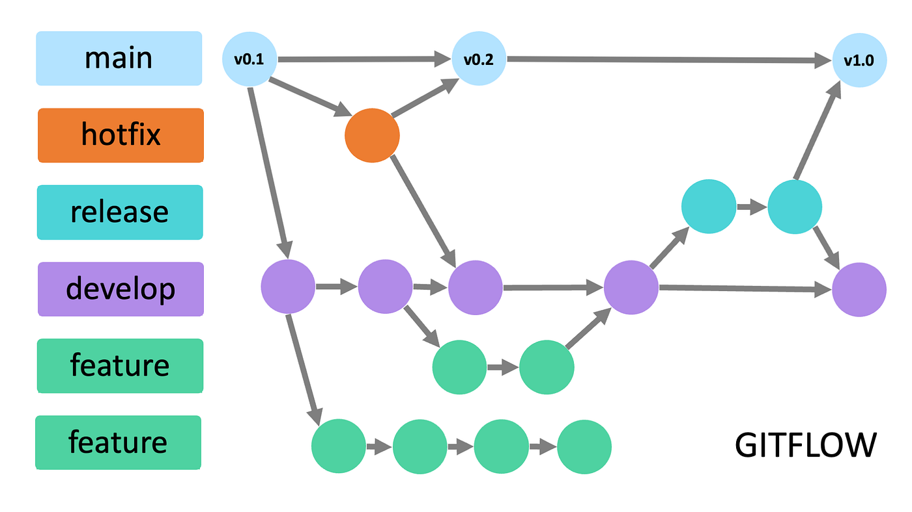

## 🌿 Flujo de Trabajo (Git Flow)

Para mantener el orden en el código y facilitar el trabajo colaborativo durante este trabajo práctico, utilizaremos una adaptación de **Git Flow**.



### 1. Ramas Principales

El repositorio se divide en dos ramas principales que tienen vida infinita:

- **`main`**: Contiene el código estable y listo para presentar/entregar. **Nadie commitea directamente a main.** Solo recibe código a través de _Pull Requests_ desde `develop`.
- **`develop`**: Es la rama de integración. Aquí se une todo el trabajo en curso. Si vas a empezar una nueva tarea, debes partir desde la última versión de esta rama.

### 2. Ramas de Apoyo

Para cada tarea, crearemos una rama temporal que luego se fusionará (merge) con `develop`. Utilizamos prefijos para identificar el propósito de la rama:

- **`feature/`**: Para nuevas funcionalidades (ej. `feature/registro-medicos`, `feature/validacion-zod`).
- **`bugfix/`**: Para solucionar errores encontrados en `develop` durante el desarrollo.
- **`hotfix/`**: Excepcional. Para errores críticos que surgen en `main` (producción o versión de entrega) y deben arreglarse de inmediato.
- **`docs/`**: Para agregar o modificar documentación.

### 3. Convenciones de Nomenclatura

- Usar siempre minúsculas.
- Separar palabras con guiones medios (`-`).
- Ser descriptivo pero conciso.
- **Formato:** `tipo/nombre-de-la-tarea` (Ejemplo: `feature/login-jwt`).

### 4. A la hora de realizar una entrega

Crearemos una rama de entrega a partir de `develop` con el prefijo `release/` (ej. `release/v1.0`). Esta rama se usará para preparar la versión final, realizar pruebas finales y corregir cualquier error crítico antes de fusionarla a `main`.

### 5. Paso a Paso: Cómo trabajar en una nueva funcionalidad

Sigue estos pasos para evitar conflictos de integración:

1. **Actualiza tu entorno local:**
   Siempre asegúrate de tener los últimos cambios antes de empezar.
   ```bash
   git checkout develop
   git pull origin develop
   ```
